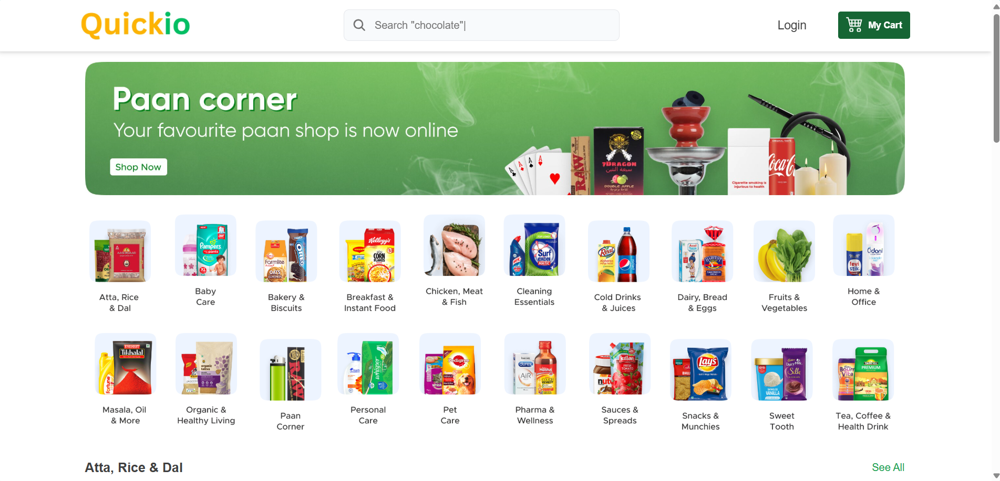

# Quickio 

Quickio is a full-fledged e-commerce platform built with React.js, Tailwind CSS, Node.js, and MongoDB. It provides users with a seamless shopping experience, secure authentication, and an intuitive admin panel for product management.


## Demo




## Features

### User Features:

- 🔑 **Authentication:** JWT-based authentication (Access & Refresh Tokens)

- 🛒 **Cart & Wishlist:** Save products for later purchases

- 🔍 **Product Search:** Fast, debounced search functionality

- 📦 **Product Browsing:** Explore products by categories and subcategories

- 📧 **Password Recovery:** Reset password functionality

- 📱 **Fully Responsive:** Optimized for all screen sizes

### Admin Features:

- 🏗️ **Product Management:** Add, update, delete products

- 📂 **Category & Subcategory Management:** Organize products efficiently

- 📊 **Dashboard:** View analytics and manage orders

## Tech Stack

- **Frontend:** React.js, Tailwind CSS

- **Backend:** Node.js, Express.js, MongoDB

- **Authentication:** JWT (Access & Refresh Tokens)


## Installation & Setup

### Prerequisites

Ensure you have the following installed:

- [Node.js](https://nodejs.org/en)

- [MongoDB](https://www.mongodb.com/)

### Clone the Repository

```bash
  git clone https://github.com/NikG100/Quickio.git
  cd Quickio
```

### Backend Setup

```bash
  cd server
  npm install
  npm run start
```

### Frontend Setup

```bash
  cd client
  npm install
  npm run dev
```

### Environment Variables

Create a `.env` file in the server directory and configure:

```env
  FRONDEND_URL = 
  MONGODB_URI = 
  RESEND_API = 
  SECRET_KEY_ACCESS_TOKEN = 
  SECRET_KEY_REFRESH_TOKEN = 
  CLODINARY_CLOUD_NAME = 
  CLODINARY_API_KEY = 
  CLODINARY_API_SECRET_KEY = 
```

    
